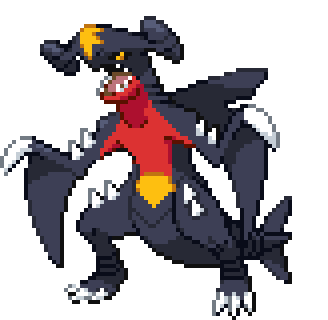

  

 

### Sobre mim

Sou **Desenvolvedor Full-Stack**, com experiência na construção, otimização e manutenção de aplicações web de ponta a ponta.

- 🎓 Cursando **Ciência da Computação** na UniFanor Wyden
- 💻 Técnico em Informática
- 🚀 Criando soluções para front-end e back-end
- 🌱 Em constante aprendizado e evolução
- ⚡ Interesses atuais: React, NestJS, Django e APIs REST

 

### Tecnologias

  

### Analytics ⚙️

  

### Vamos nos conectar?

  

 

  
   
  Construindo, aprendendo e evoluindo — um commit por vez.

